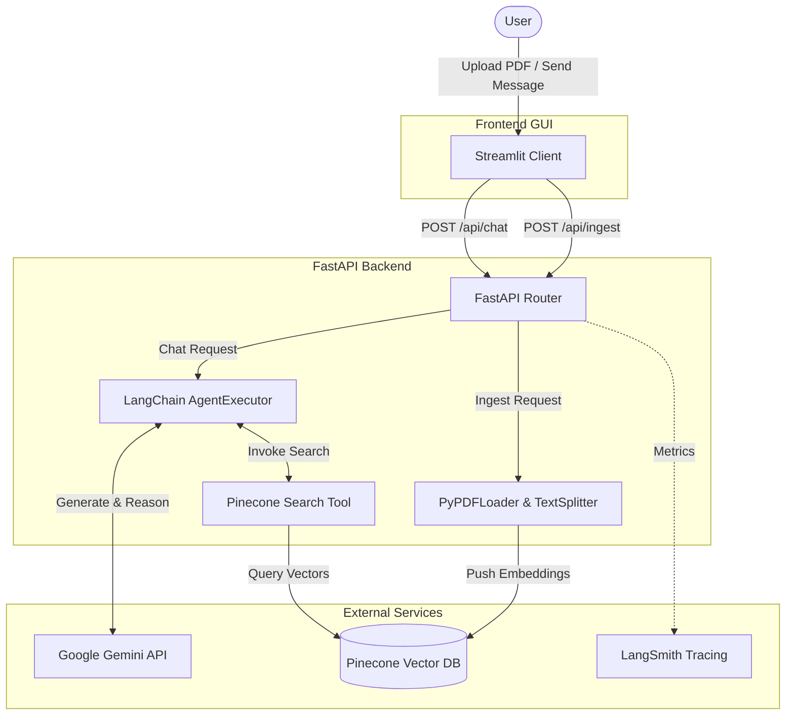

# Agentic Personal Assistant

A full-stack agentic RAG (Retrieval-Augmented Generation) application that allows users to upload PDF documents and chat with them using an intelligent AI agent.

## 🚀 Features

- **PDF Document Ingestion**: Upload and process PDF files into a vector database
- **Agentic Chat**: Intelligent agent that decides when to search the knowledge base
- **Conversation Memory**: Maintains context across multiple questions
- **Modern UI**: ChatGPT-like interface with file upload capabilities
- **Observability**: Integrated with LangSmith for monitoring and tracing

## 🏗️ Architecture



### Backend (Python/FastAPI)
- **Server**: FastAPI server with CORS and file upload support
- **Agent**: LangChain ReAct agent with Google Gemini (`gemini-1.5-flash`)
- **Vector Database**: Pinecone for document storage and similarity search
- **Embeddings**: Pinecone-hosted `llama-text-embed-v2` model
- **Observability**: LangSmith for tracing and monitoring

### Frontend (Python/Streamlit)
- **UI Framework**: Streamlit for fast data-app development
- **File Upload**: Native file uploader to trigger backend ingestion
- **Chat Interface**: Native `st.chat_message` conversational UI

## 📋 Prerequisites

- Python 3.9+
- Pinecone account with index created
- Google Gemini API key
- LangSmith account (optional, for observability)

## 🛠️ Setup

1. **Clone the repository**
   ```bash
   git clone <repository-url>
   cd agentic-personal-assistant
   ```

2. **Install dependencies**
   ```bash
   # Install Server dependencies
   cd server
   pip install -r requirements.txt
   cd ..
   
   # Install Client dependencies
   cd client
   pip install -r requirements.txt
   cd ..
   ```

3. **Environment Configuration**
   ```bash
   cp .env.example .env
   ```

   Edit `.env` with your API keys:
   ```env
   # LLM
   GOOGLE_API_KEY=your_google_api_key
   
   # Vector DB (Pinecone)
   PINECONE_API_KEY=your_pinecone_api_key
   PINECONE_INDEX=your_pinecone_index_name
   
   # LangSmith tracing (Optional)
   LANGSMITH_TRACING=true
   LANGSMITH_ENDPOINT=https://api.smith.langchain.com
   LANGSMITH_API_KEY=langsmith_key
   LANGSMITH_PROJECT="Project name"
   ```

## 🚀 Running the Application

### Concurrent Mode (Recommended)
You can start both the FastAPI server and Streamlit client at the same time:

**Windows (PowerShell):**
```powershell
.\run.ps1
```

**macOS/Linux:**
```bash
./run.sh
```

### Individual Services
```bash
# Server only
cd server
uvicorn main:app --port 3001 --reload

# Client only  
cd client
streamlit run app.py
```

## 📁 Project Structure

```
agentic-personal-assistant/
├── server/                 # FastAPI Backend
│   ├── main.py            # API routes and Server entry
│   ├── agent.py           # Langchain Generative Agent
│   ├── tools.py           # Pinecone vector search
│   ├── ingest.py          # PDF document ingestion
│   └── requirements.txt   # Server dependencies
├── client/                # Streamlit Frontend app
│   ├── app.py             # Streamlit graphical interface
│   └── requirements.txt   # Client dependencies
├── run.ps1                # Windows concurrent startup script
├── run.sh                 # Linux/Mac concurrent startup script
├── .env.example           # Environment variables template
└── README.md              # This file
```

## 🔄 How It Works

### Document Ingestion
1. User uploads PDF via frontend
2. Server receives file and extracts text using PDFLoader
3. Text is split into chunks (1000 chars with 200 overlap)
4. Chunks are converted to embeddings using Pinecone's model
5. Embeddings are stored in Pinecone vector database

### Chat Flow
1. User sends a message
2. Agent receives message with conversation history
3. Agent decides whether to search the knowledge base
4. If needed, searches Pinecone for relevant document chunks
5. Agent uses retrieved context to generate response
6. Response is sent back to user and added to conversation history

## 🔧 Key Components

### Agent (`server/agent.js`)
- ReAct agent using LangChain's `createAgent`
- MemorySaver for conversation persistence
- Tool calling for knowledge base search

### Search Tool (`server/tools.js`)
- Pinecone vector store integration
- Similarity search with top-k results
- Lazy initialization for environment variables

### Ingestion Pipeline (`server/ingest.js`)
- PDF text extraction and chunking
- Batch processing (96 chunks per API call)
- Pinecone upsert operations

### Frontend (`client/src/App.jsx`)
- React state management for chat and upload
- File upload with progress feedback
- Real-time chat interface with auto-scroll

## 🐛 Troubleshooting

### Common Issues

1. **Connection Refused Error**
   - Ensure server is running on port 3001
   - Check for port conflicts: `lsof -i :3001`

2. **Environment Variables Missing**
   - Verify `.env` file exists in server directory
   - Check all required API keys are set

3. **Pinecone API Errors**
   - Verify Pinecone index exists
   - Check API key permissions
   - Ensure embedding model matches ingestion/retrieval

4. **Dependency Installation Errors**
   - Use `--legacy-peer-deps` flag for peer dependency conflicts
   - Clear node_modules and reinstall if needed

## 📚 Technologies Used

- **Backend**: Python, FastAPI, Uvicorn
- **Frontend**: React, Vite
- **AI/ML**: LangChain, Google Gemini
- **Vector DB**: Pinecone
- **Observability**: LangSmith
- **Development**: Concurrently, ESLint

## 🤝 Contributing

1. Fork the repository
2. Create a feature branch
3. Make your changes
4. Test thoroughly
5. Submit a pull request

## 📄 License

This project is licensed under the MIT License.
